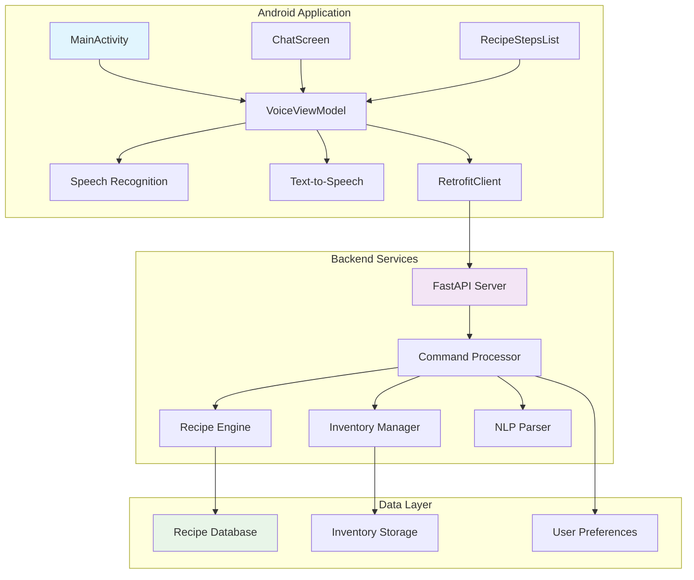
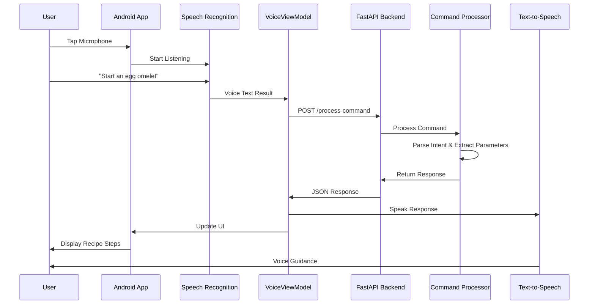
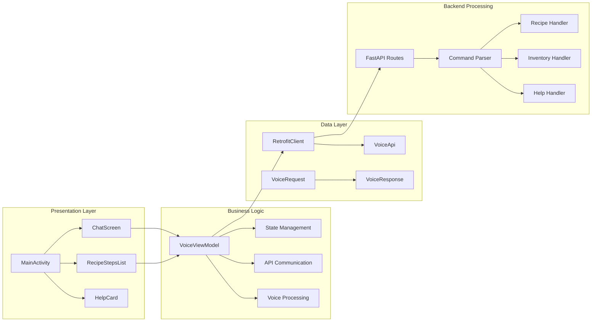
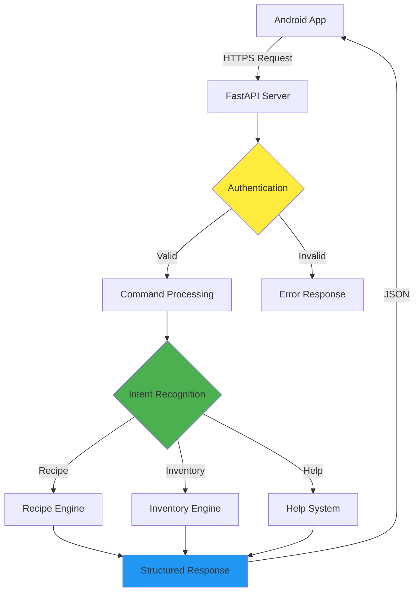

# 🥗 MealLens Voice Assistant

<div align="center">


[](https://kotlinlang.org)
[](https://developer.android.com/jetpack/compose)
[](https://fastapi.tiangolo.com)
[](https://python.org)

**A sophisticated voice-controlled recipe assistant and inventory management system**

*Revolutionizing cooking with AI-powered voice commands and intelligent recipe guidance*

</div>

---

## 📋 Table of Contents

- [🎯 Overview](#-overview)
- [✨ Features](#-features)
- [🏗️ System Architecture](#️-system-architecture)
- [🎤 Voice Commands](#-voice-commands)
- [🛠️ Tech Stack](#️-tech-stack)
- [📱 Screenshots & Demo](#-screenshots--demo)
- [🚀 Quick Start](#-quick-start)
- [⚙️ Detailed Setup](#️-detailed-setup)
- [🔧 Development](#-development)
- [🧪 Testing](#-testing)
- [🚀 Deployment](#-deployment)
- [🤝 Contributing](#-contributing)
- [📄 License](#-license)

---

## 🎯 Overview

MealLens Voice Assistant is a cutting-edge culinary companion that transforms your cooking experience through natural language voice commands. Built with modern Android development practices and powered by intelligent backend processing, it provides step-by-step recipe guidance and smart inventory management.

### 🌟 Why MealLens?

- **🎤 Hands-Free Cooking**: Keep your hands clean while getting recipe guidance
- **🧠 Smart Understanding**: Natural language processing understands conversational commands
- **📦 Inventory Intelligence**: Track ingredients with voice commands
- **🍳 Step-by-Step Guidance**: Never miss a step with voice-guided cooking
- **📱 Modern Design**: Beautiful, intuitive Material Design 3 interface

---

## ✨ Features

### 🎤 Voice Recognition & Control
- **Natural Language Processing**: Understands conversational voice commands
- **Real-time Speech-to-Text**: Instant voice recognition with Android SpeechRecognizer
- **Text-to-Speech Responses**: Clear, natural voice feedback
- **Multi-format Number Recognition**: "five", "5", "a couple", "dozen" - all understood

### 🍳 Recipe Management
- **Voice-Guided Cooking**: Step-by-step instructions with voice navigation
- **Recipe Navigation**: "Next step", "Previous step", "Repeat" commands
- **Multiple Cuisines**: Expandable recipe database
- **Timing Guidance**: Built-in cooking time estimates

### 📦 Smart Inventory
- **Voice-Controlled Adding**: "Add 5 apples to inventory"
- **Intelligent Usage Tracking**: "I used 2 eggs" 
- **Quantity Queries**: "How many tomatoes do I have?"
- **Smart Pluralization**: Automatic singular/plural handling

### 🤖 AI-Powered Intelligence
- **Context Awareness**: Understands cooking context and recipe state
- **Error Handling**: Graceful fallbacks for unrecognized commands
- **Learning Patterns**: Adapts to user speech patterns
- **Command Suggestions**: Intelligent help system

### 📱 Modern Android Experience
- **Jetpack Compose UI**: Smooth, responsive modern interface
- **Material Design 3**: Beautiful, accessible design language
- **Real-time Chat Interface**: Conversation-style interaction
- **Responsive Design**: Works on phones and tablets

---

## 🏗️ System Architecture

### 📊 High-Level Architecture



### 🔄 Data Flow Architecture



### 🧩 Component Architecture



### 🔐 Security & API Flow



---

## 🎤 Voice Commands

### 🍳 Recipe Commands

| Command | Description | Example |
|---------|-------------|---------|
| **Start Recipe** | Begin cooking a specific dish | *"Start an egg omelet"* |
| **Next Step** | Move to the next cooking step | *"Next step"*, *"What's next?"* |
| **Previous Step** | Go back to previous step | *"Previous step"*, *"Go back"* |
| **Repeat Step** | Hear current step again | *"Repeat"*, *"Say that again"* |
| **Stop Recipe** | Exit recipe mode | *"Stop recipe"*, *"Exit cooking"* |

### 📦 Inventory Commands

| Command | Description | Example |
|---------|-------------|---------|
| **Add Items** | Add ingredients to inventory | *"Add 5 apples"*, *"Add a dozen eggs"* |
| **Use Items** | Remove items from inventory | *"Use 2 tomatoes"*, *"I used 3 onions"* |
| **Check Quantity** | Query item quantities | *"How many apples do I have?"* |
| **Show Inventory** | Display all items | *"Show my inventory"*, *"What's in my fridge?"* |

### 🆘 Help & Navigation

| Command | Description | Example |
|---------|-------------|---------|
| **Help Menu** | Show available commands | *"What can you do?"*, *"Help"* |
| **Recipe List** | Show available recipes | *"What recipes do you know?"* |
| **Status Check** | Current app status | *"Where am I?"*, *"What step am I on?"* |

### 🔢 Smart Number Recognition

MealLens understands various number formats:

```
Numeric: "5 apples", "10 tomatoes"
Written: "five apples", "ten tomatoes"  
Casual: "a couple of onions", "a few carrots"
Quantities: "a dozen eggs", "a pound of flour"
Articles: "an apple", "a tomato"
```

---

## 🛠️ Tech Stack

### 📱 Android Frontend

| Technology | Version | Purpose |
|------------|---------|---------|
| **Kotlin** | 1.9.0 | Primary programming language |
| **Jetpack Compose** | 1.5.0 | Modern declarative UI toolkit |
| **Material Design 3** | Latest | Design system and components |
| **Android SDK** | API 24+ | Android development platform |
| **Retrofit** | 2.9.0 | HTTP client for API communication |
| **Coroutines** | 1.7.3 | Asynchronous programming |
| **ViewModel** | 2.8.3 | MVVM architecture component |
| **Speech Recognition** | Native | Android speech-to-text API |
| **Text-to-Speech** | Native | Android text-to-speech API |

### 🐍 Backend Services

| Technology | Version | Purpose |
|------------|---------|---------|
| **Python** | 3.11+ | Backend programming language |
| **FastAPI** | 0.104.1 | Modern web framework |
| **Uvicorn** | 0.24.0 | ASGI server implementation |
| **Pydantic** | 2.5.0 | Data validation and serialization |
| **word2number** | 1.1 | Natural language number parsing |

### 🏗️ Architecture Patterns

- **MVVM (Model-View-ViewModel)**: Clean separation of concerns
- **Repository Pattern**: Data access abstraction
- **Dependency Injection**: Loose coupling and testability
- **RESTful API**: Standard HTTP communication
- **Reactive Programming**: Real-time UI updates

---

## 📱 Screenshots & Demo

### 🖼️ Application Screenshots

<div align="center">

| Home Screen | Recipe Mode | Inventory View |
|-------------|-------------|----------------|
|  |  |  |

| Voice Recognition | Help Menu | Chat Interface |
|-------------------|-----------|----------------|
|  |  |  |

</div>

### 🎥 Demo Video

> **Note**: Replace with actual demo video link once available

```markdown
[](https://www.youtube.com/watch?v=VIDEO_ID)
```

### 💬 Sample Interactions

```
👤 User: "What can you do?"
🤖 MealLens: "I can help you with recipes and inventory management. 
           Try saying 'start an egg omelet' or 'add 5 apples'."

👤 User: "Start an egg omelet"
🤖 MealLens: "Starting egg omelet recipe. Crack 3 eggs into a bowl 
           and whisk them with a fork until well blended."

👤 User: "Next step"
🤖 MealLens: "Add a pinch of salt and pepper to the eggs for seasoning."

👤 User: "Add 5 apples"
🤖 MealLens: "Okay, I've added 5 apples to your inventory."
```

---

## 🚀 Quick Start

### ⚡ 5-Minute Setup

1. **Clone Repository**
   ```bash
   git clone https://github.com/yourusername/meallens-voice-assistant.git
   cd meallens-voice-assistant
   ```

2. **Start Backend**
   ```bash
   cd backend
   python -m venv venv
   venv\Scripts\activate  # Windows
   pip install -r requirements.txt
   uvicorn main:app --reload
   ```

3. **Open Android Studio**
   - Open the project
   - Sync Gradle files
   - Run on emulator or device

4. **Test Voice Commands**
   - Tap microphone button
   - Say: *"What can you do?"*
   - Enjoy your voice assistant! 🎉

### 🔗 Prerequisites

- **Android Studio** (Electric Eel or newer)
- **Java 17+**
- **Python 3.11+**
- **Android device/emulator** (API 24+)

---

## ⚙️ Detailed Setup

### 🐍 Backend Setup

#### 1. Environment Setup
```bash
# Create project directory
mkdir meallens-voice-assistant
cd meallens-voice-assistant

# Clone repository
git clone <repository-url> .

# Navigate to backend
cd backend

# Create virtual environment
python -m venv venv

# Activate virtual environment
# Windows:
venv\Scripts\activate
# macOS/Linux:
source venv/bin/activate
```

#### 2. Install Dependencies
```bash
# Upgrade pip
pip install --upgrade pip

# Install core dependencies
pip install fastapi==0.104.1
pip install "uvicorn[standard]==0.24.0"
pip install pydantic==2.5.0
pip install word2number==1.1

# Or install from requirements file
pip install -r requirements.txt
```

#### 3. Start Development Server
```bash
# Start with hot reload
uvicorn main:app --reload

# Start with custom host/port
uvicorn main:app --host 0.0.0.0 --port 8000 --reload

# Production mode
uvicorn main:app --host 0.0.0.0 --port 8000
```

#### 4. Verify Backend
```bash
# Test API endpoint
curl http://localhost:8000/docs

# Test voice command
curl -X POST "http://localhost:8000/process-command" \
     -H "Content-Type: application/json" \
     -d '{"text": "start an egg omelet"}'
```

### 📱 Android Setup

#### 1. Environment Requirements
```bash
# Verify Java installation
java -version  # Should show Java 17+

# Verify Android SDK
echo $ANDROID_HOME  # Should point to Android SDK

# Verify ADB
adb --version
```

#### 2. Project Setup
```bash
# Open in Android Studio
studio .  # or use File > Open

# Or via command line build
./gradlew assembleDebug
./gradlew installDebug
```

#### 3. Emulator Setup
```bash
# List available AVDs
emulator -list-avds

# Start emulator
emulator -avd "Pixel_7_API_34"

# Or create new AVD
avdmanager create avd -n "MealLens_Test" -k "system-images;android-34;google_apis;x86_64"
```

#### 4. Run Application
```bash
# Install and run
./gradlew installDebug

# Run tests
./gradlew test
./gradlew connectedAndroidTest
```

### 🔧 Configuration

#### Backend Configuration
Create `.env` file in backend directory:
```env
# Server Configuration
HOST=0.0.0.0
PORT=8000
DEBUG=True

# API Configuration
API_VERSION=v1
API_PREFIX=/api

# Logging
LOG_LEVEL=INFO
```

#### Android Configuration
Update `local.properties`:
```properties
# Android SDK location
sdk.dir=C:\\Users\\YourName\\AppData\\Local\\Android\\Sdk

# NDK location (if needed)
ndk.dir=C:\\Users\\YourName\\AppData\\Local\\Android\\Sdk\\ndk\\25.1.8937393
```

---

## 🔧 Development

### 🏗️ Project Structure

```
meallens-voice-assistant/
├── 📱 android-app/                 # Android application
│   ├── 📂 app/
│   │   ├── 📂 src/main/java/com/example/voiceassistantapp/
│   │   │   ├── 📄 MainActivity.kt           # Main activity
│   │   │   ├── 📄 VoiceViewModel.kt         # Business logic
│   │   │   ├── 📂 api/                      # API interfaces
│   │   │   │   ├── 📄 RetrofitClient.kt     # HTTP client
│   │   │   │   └── 📄 VoiceApi.kt           # API definitions
│   │   │   ├── 📂 model/                    # Data models
│   │   │   │   ├── 📄 VoiceRequest.kt       # API request model
│   │   │   │   └── 📄 VoiceResponse.kt      # API response model
│   │   │   └── 📂 ui/                       # UI components
│   │   │       ├── 📄 ChatScreen.kt         # Main chat interface
│   │   │       ├── 📄 RecipeStepsList.kt    # Recipe display
│   │   │       ├── 📄 HelpCard.kt           # Help system
│   │   │       └── 📂 theme/                # UI theming
│   │   ├── 📄 AndroidManifest.xml           # App permissions
│   │   └── 📄 build.gradle.kts              # App dependencies
│   ├── 📄 build.gradle.kts                  # Project config
│   └── 📄 settings.gradle.kts               # Gradle settings
├── 🐍 backend/                      # FastAPI backend
│   ├── 📄 main.py                           # FastAPI server
│   ├── 📄 commands.py                       # Command processing
│   ├── 📄 requirements.txt                  # Python dependencies
│   └── 📂 tests/                            # Backend tests
├── 📚 docs/                         # Documentation
│   ├── 📄 API.md                            # API documentation
│   ├── 📄 DEPLOYMENT.md                     # Deployment guide
│   └── 📄 CONTRIBUTING.md                   # Contribution guide
├── 🧪 tests/                        # Integration tests
├── 📄 README.md                             # This file
├── 📄 .gitignore                            # Git ignore rules
└── 📄 LICENSE                               # License information
```

### 🔄 Development Workflow

#### 1. Feature Development
```bash
# Create feature branch
git checkout -b feature/new-recipe-engine

# Make changes
# ... development work ...

# Run tests
./gradlew test  # Android tests
pytest          # Backend tests

# Commit changes
git add .
git commit -m "feat: add new recipe engine with enhanced parsing"

# Push and create PR
git push origin feature/new-recipe-engine
```

#### 2. Code Quality

```bash
# Android linting
./gradlew lint

# Kotlin formatting
./gradlew ktlintFormat

# Python formatting
black backend/
flake8 backend/

# Type checking
mypy backend/
```

#### 3. Testing Strategy

```bash
# Unit tests
./gradlew test                    # Android unit tests
pytest backend/tests/unit/        # Python unit tests

# Integration tests
./gradlew connectedAndroidTest    # Android instrumented tests
pytest backend/tests/integration/ # API integration tests

# End-to-end tests
pytest backend/tests/e2e/         # Full system tests
```

### 🎨 Adding New Features

#### Adding New Voice Commands

1. **Backend Command Processing** (`commands.py`):
```python
def process_voice_command(text: str):
    lower = text.lower().strip()
    
    # Add new command
    if "new command" in lower:
        return reply("NEW_INTENT", {"param": "value"}, "Response text")
```

2. **Android Command Handling** (`VoiceViewModel.kt`):
```kotlin
fun processVoiceCommand(command: String) {
    when {
        "new command" in lower -> {
            // Handle new command locally if needed
        }
    }
}
```

#### Adding New Recipes

1. **Define Recipe Structure**:
```python
new_recipe_steps = [
    "Step 1: Prepare ingredients...",
    "Step 2: Heat the pan...",
    "Step 3: Cook and serve..."
]
```

2. **Add Recipe Recognition**:
```python
if "start" in lower and "new recipe" in lower:
    current_step = 0
    return reply("START_RECIPE", {"recipe_name": "new_recipe"}, new_recipe_steps[0])
```

### 📐 Architecture Guidelines

#### Android Architecture (MVVM)
```kotlin
// ✅ Good: Separation of concerns
class VoiceViewModel : ViewModel() {
    private val repository = VoiceRepository()
    
    fun processCommand(command: String) {
        viewModelScope.launch {
            val result = repository.sendCommand(command)
            updateUI(result)
        }
    }
}

// ❌ Bad: Business logic in UI
class MainActivity : ComponentActivity() {
    fun onVoiceCommand(command: String) {
        // Don't put business logic here
        val result = RetrofitClient.api.sendCommand(command)
    }
}
```

#### Backend Architecture (Clean API)
```python
# ✅ Good: Clean separation
@app.post("/process-command")
async def process_command(request: VoiceRequest) -> VoiceResponse:
    result = command_processor.process(request.text)
    return VoiceResponse(**result)

# ❌ Bad: Mixed concerns
@app.post("/process-command")  
async def process_command(request: VoiceRequest):
    # Don't mix parsing, processing, and response formatting
```

---

## 🧪 Testing

### 🎯 Testing Strategy

#### Test Pyramid
```
    🔺 E2E Tests (10%)
   🔺🔺 Integration Tests (20%)
  🔺🔺🔺 Unit Tests (70%)
```

### 📱 Android Testing

#### Unit Tests
```kotlin
@Test
fun `voice command processing returns correct response`() {
    // Given
    val viewModel = VoiceViewModel()
    val command = "start an egg omelet"
    
    // When
    viewModel.processVoiceCommand(command)
    
    // Then
    assertEquals("START_RECIPE", viewModel.currentIntent.value)
}
```

#### Instrumented Tests
```kotlin
@Test
fun `microphone button starts voice recognition`() {
    // Given
    val activityRule = ActivityTestRule(MainActivity::class.java)
    
    // When
    onView(withId(R.id.micButton)).perform(click())
    
    // Then
    onView(withText("Listening...")).check(matches(isDisplayed()))
}
```

### 🐍 Backend Testing

#### API Tests
```python
def test_process_command_recipe():
    # Given
    request = {"text": "start an egg omelet"}
    
    # When
    response = client.post("/process-command", json=request)
    
    # Then
    assert response.status_code == 200
    assert response.json()["intent"] == "START_RECIPE"
```

#### Integration Tests
```python
def test_full_recipe_flow():
    # Test complete recipe interaction
    commands = [
        "start an egg omelet",
        "next step", 
        "previous step",
        "stop recipe"
    ]
    
    for command in commands:
        response = client.post("/process-command", json={"text": command})
        assert response.status_code == 200
```

### 🤖 Automated Testing

#### CI/CD Pipeline
```yaml
# .github/workflows/test.yml
name: Test Suite
on: [push, pull_request]

jobs:
  android-tests:
    runs-on: ubuntu-latest
    steps:
      - uses: actions/checkout@v3
      - name: Setup JDK
        uses: actions/setup-java@v3
        with:
          java-version: '17'
      - name: Run tests
        run: ./gradlew test

  backend-tests:
    runs-on: ubuntu-latest
    steps:
      - uses: actions/checkout@v3
      - name: Setup Python
        uses: actions/setup-python@v4
        with:
          python-version: '3.11'
      - name: Install dependencies
        run: pip install -r backend/requirements.txt
      - name: Run tests
        run: pytest backend/tests/
```

---

## 🚀 Deployment

### ☁️ Backend Deployment

#### Docker Deployment
```dockerfile
FROM python:3.11-slim

WORKDIR /app
COPY backend/requirements.txt .
RUN pip install -r requirements.txt

COPY backend/ .
EXPOSE 8000

CMD ["uvicorn", "main:app", "--host", "0.0.0.0", "--port", "8000"]
```

#### Docker Compose
```yaml
version: '3.8'
services:
  backend:
    build: .
    ports:
      - "8000:8000"
    environment:
      - DEBUG=False
      - HOST=0.0.0.0
    restart: unless-stopped
```

#### Cloud Deployment Options

**AWS Deployment:**
```bash
# Using AWS App Runner
aws apprunner create-service \
    --service-name meallens-backend \
    --source-configuration '{
        "CodeRepository": {
            "RepositoryUrl": "https://github.com/user/repo",
            "SourceCodeVersion": {"Type": "BRANCH", "Value": "main"}
        }
    }'
```

**Google Cloud Run:**
```bash
# Deploy to Cloud Run
gcloud run deploy meallens-backend \
    --source . \
    --platform managed \
    --region us-central1 \
    --allow-unauthenticated
```

**Heroku Deployment:**
```bash
# Create Heroku app
heroku create meallens-backend

# Deploy
git push heroku main

# Set environment variables
heroku config:set DEBUG=False
```

### 📱 Android Deployment

#### Build Release APK
```bash
# Generate signed APK
./gradlew assembleRelease

# Generate AAB for Play Store
./gradlew bundleRelease
```

#### Play Store Deployment
```yaml
# fastlane/Fastfile
lane :deploy do
  gradle(task: "bundleRelease")
  upload_to_play_store(
    track: 'production',
    aab: 'app/build/outputs/bundle/release/app-release.aab'
  )
end
```

### 🔐 Security Considerations

#### API Security
```python
from fastapi import Depends, HTTPException
from fastapi.security import HTTPBearer

security = HTTPBearer()

@app.post("/process-command")
async def process_command(
    request: VoiceRequest,
    token: str = Depends(security)
):
    if not verify_token(token):
        raise HTTPException(401, "Invalid token")
    return process_voice_command(request.text)
```

#### Network Security
```xml
<!-- network_security_config.xml -->
<network-security-config>
    <domain-config cleartextTrafficPermitted="false">
        <domain includeSubdomains="true">api.meallens.com</domain>
    </domain-config>
</network-security-config>
```

---

## 🤝 Contributing

### 🌟 How to Contribute

We welcome contributions! Here's how you can help:

#### 🐛 Bug Reports
1. Check existing issues first
2. Use the bug report template
3. Include reproduction steps
4. Add system information

#### ✨ Feature Requests
1. Check the roadmap first
2. Use the feature request template
3. Explain the use case
4. Consider implementation complexity

#### 🔧 Code Contributions
1. Fork the repository
2. Create a feature branch
3. Follow coding standards
4. Add tests for new features
5. Update documentation
6. Submit a pull request

### 📝 Development Guidelines

#### Code Style
```kotlin
// Kotlin style guidelines
class VoiceViewModel : ViewModel() {
    // Use meaningful names
    private val _isListening = MutableLiveData<Boolean>()
    val isListening: LiveData<Boolean> = _isListening
    
    // Document complex functions
    /**
     * Processes voice command and updates UI state
     * @param command The voice command text
     */
    fun processVoiceCommand(command: String) {
        // Implementation
    }
}
```

```python
# Python style guidelines
def process_voice_command(text: str) -> Dict[str, Any]:
    """
    Process voice command and return structured response.
    
    Args:
        text: The voice command text
        
    Returns:
        Dict containing intent, parameters, and response text
    """
    # Implementation
    pass
```

#### Commit Message Format
```
feat: add new recipe navigation commands
fix: resolve voice recognition timeout issue  
docs: update API documentation
test: add unit tests for inventory management
refactor: improve command parsing performance
```

### 🎯 Roadmap

#### Short Term (1-2 months)
- [ ] Add more recipe categories
- [ ] Improve voice recognition accuracy
- [ ] Add recipe search functionality
- [ ] Implement user preferences

#### Medium Term (3-6 months)
- [ ] Multi-language support
- [ ] Cloud recipe synchronization
- [ ] Advanced meal planning
- [ ] Integration with grocery APIs

#### Long Term (6+ months)
- [ ] Computer vision ingredient recognition
- [ ] Smart home integration
- [ ] Nutritional analysis
- [ ] Social recipe sharing

---

## 📄 License

### MIT License

```
MIT License

Copyright (c) 2025 MealLens Voice Assistant
